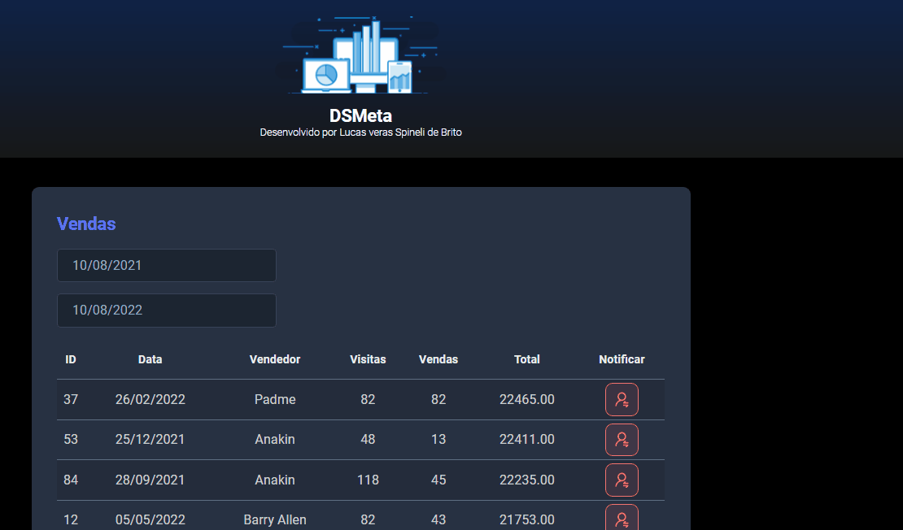

<h1 align="center">Projeto Semana Spring React  🚀🚀</h1>

## Finalidade do Projeto 

O projeto da <a href ="https://devsuperior.com.br/evento-sds"> 
Escola Devsuperior </a> realizado na **Semana Spring React** com intuito de criar um aplicativo completo com as tecnologias mais demandadas do mercado, e um maior crescimento profissional.

## Descrição  
<p>
O projeto é um site estático onde contém dois campos que o usuário pode filtar entre a data inicial e a data final onde tem uma tabela com uma lista de vendedores com vários campos
como o nome do vendedor, quantidade de visitas que ele fez, a soma total de vendas que ele realizou durante o período selecionado e um botão que ao clicar, é enviado 
automaticamente uma mensagem para o celular do vendedor, informando que ele foi destaque no mês mostrando o valor do seu saldo de vendas naquele mês.
<p>

<h2><p align="center">Apresentação do projeto</p></h2>
</p>
<h1 align="center">
    
</h1>

### Pré-requisitos
Antes de começar, você vai instalar em suas máquinas as seguintes ferramentas:
- [Git](https://git-scm.com) 
- [Nodejs 16 e Yarn](https://nodejs.org/en/)
 
É necessário também um editor para manipular o código fonte, este projeto foi feito com editor VSCode
- [VSCode](https://code.visualstudio.com/).

É necessário o kit de desenvolvimento Java, pode ser utilizado o JDK 8 até as versões mais recentes.
- [JDK 8](https://www.oracle.com/br/java/technologies/javase/javase8u211-later-archive-downloads.html)

Para testar os serviços foi usado o Postman
- [Postman](https://www.postman.com/).

IDE usado foi o STS
- [STS](https://spring.io/tools)

- [Heroku CLI](https://devcenter.heroku.com/articles/heroku-cli)

 ### ⚡ Rodando o Front End ⚡

```bash
# Clonando o repositório
$ git clone git@github.com:lucasverasspineli/dsmeta.git
# Acessando o repositório
$ cd dsmeta
# Acessando a pasta do projeto referente ao Frontend 
$ cd frontend
# Executando o projeto
$ yarn dev
```
Para enviar sms será necessário ter uma conta na [Twilio](https://www.twilio.com/pt-br/), para poder usar serviços. 

É necessário configurar variáveis de ambiente com algumas informações para poder usar o twilio integrando com código.
Todas essas variáveis de ambiente são disponibilizadas lá no Twilio, onde contém Account SID, token, My twilio phone number que é o número que a twilio cria e você cadastra o seu número para servir de envio.

```
twilio.sid=${TWILIO_SID}
twilio.key=${TWILIO_KEY}
twilio.phone.from=${TWILIO_PHONE_FROM}
twilio.phone.to=${TWILIO_PHONE_TO}
```

## Implantação no Heroku

- Na pasta principal do projeto dsmeta criar uma pasta.

📁 system.properties

```bash
# Para saber a versão do heroku
heroku -v
# Realizando o Login
heroku login
# Ele associa o repositório da máquina com o Heroku, colocar o nome do seu app
heroku git:remote -a nome-do-app
# Ele mostra a associação com github com o heroku
git remote -v
# Responsável por fazer o deploy, e baixando todas as dependências necessárias
git subtree push --prefix backend heroku main
```

## Resumo das ferramentas usadas no Projeto

O projeto no frontend usa o React, com requisições com axios e useEffect o backend foi feito na linguagem Java usando o framework Spring-boot, com o banco H2, consumindo a API de mensagem do Twilio, com toda a integração do back-end realizado no heroku.
